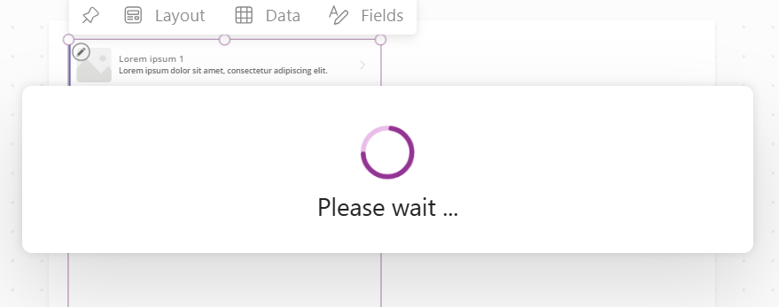

Steps to PowerApp Creation

Download the data from below link

https://github.com/geethasamynathan/PowerApp-Notes/blob/main/Products.xlsx

upload the excel.xlsx file into Onedrive 

appName ==> ProductDisplay ==> 

from the left pane ==> 

Go back to Treeview of your app

choose the screen1
 
 

 By default it will be showing the sample data

 

 let us add our datasource to display our products

 Select Gallery1 ==> on the top you can find Data => click that ==> choose the datasource

 

 once you click the onedrive it takes few minutes to attach the data into our Gallery
 

 

 
 

 

 add a Form for CRUD OPeration

 

 Data ==> Choose the table from onedrive ==>
 

 

 Add fields ==> choose the columns to add in the form
 select the Form ==> column = 1
 

 After reorder the fields in the form .

 Next we will change cateroy control should be dropdownlist

 select the CategoryDatacard ==> Delete categoryDatacardValue field ==>
 in that place insert dropdownlist

 

 Insert ==> dropdownlist
 
Categorydatacard
update  = ddlCategory.Selected.Value

While running if the form is not visible change Form DEfaultMode property= New

then run

Select the Form1 from Left pane
insert ==> Button ==> 
change the Text Property as Save Changes

Button placed outside of the form
but we need place it inside the form

Form should the selected prodcut details from gallery

Form DEfaultMode ==>Edit 

Select the button ==> On select = sunbmitForm(Form1)

Run  

update the product  click savechanges it will update in datasource too

Next we will Add New Product

Addnew button on the top form

onselect = NewForm(Form1);UpdateContext({isNewRecord:true})

select the SaveChanges(button1)  property

Onselect event of Button (save changes) 
If(
    isNewRecord,
    SubmitForm(Form1); 
    UpdateContext({isNewRecord: false}),  // Reset the flag after saving new record
    SubmitForm(Form1) // Normal Save for existing records
)

